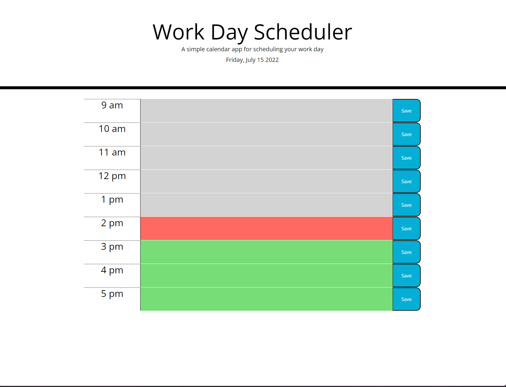

# coolest-work-planner
Very cool work planner - Can enter details for each hour of the 9 to 5 work day and save the the notes to local storage.

# Description

The work day scheduler features a 9 am to 5 pm work day scheduler. You can save details for each hours plans and details and then save the details, that way when the page is refreshed the details the user entered can still be viewed. The planner shows if the the time block is in the future, present or past.

# Screenshot

# Link to deployed application

https://jordanb366.github.io/coolest-work-planner/
